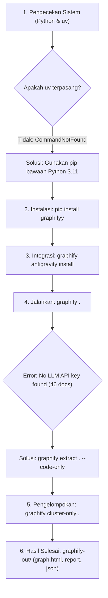

# Catatan Belajar: Alur Kerja, Masalah/Error, dan Solusi Pemasangan Graphify

Dokumen ini mencatat seluruh proses nyata saat memasang Graphify, masalah/error yang dialami, penyebab teknis, dan solusi langkah demi langkah yang berhasil diterapkan pada sistem Windows dan Google Antigravity.

---

## 1. Diagram Alur Proses & Troubleshooting



---

## 2. Rincian Kronologi Langkah & Masalah yang Ditemukan

### Tahap 1: Pengecekan Lingkungan (Environment Check)
* **Tindakan:**  
  Menjalankan perintah verifikasi tool:
  ```powershell
  python --version; uv --version
  ```
* ❌ **Error yang Muncul:**
  ```text
  uv : The term 'uv' is not recognized as the name of a cmdlet, function, script file...
  ```
* 🔍 **Analisis Masalah:**  
  Tool `uv` (package manager Python yang baru) belum terpasang di sistem Windows Anda. Namun, `Python 3.11.0` sudah aktif.
* 💡 **Solusi:**  
  Mengecek kesiapan `pip` bawaan Python (`pip --version`). Ternyata `pip 26.0.1` sudah siap, sehingga kita dapat langsung menginstal paket menggunakan `pip` tanpa mewajibkan instalasi `uv` terlebih dahulu.

---

### Tahap 2: Pemasangan Paket Inti Graphify
* **Tindakan:**  
  Menginstal library resmi dari PyPI:
  ```powershell
  pip install graphifyy
  ```
* 📌 **Pelajaran Penting:**  
  Nama paket di PyPI adalah **`graphifyy`** (dua huruf **y** di akhir), sedangkan nama perintah terminal yang digunakan adalah **`graphify`**.
* **Hasil:**  
  Berhasil memasang `graphifyy-0.9.53` beserta parser syntax Tree-Sitter (untuk Dart, Python, JavaScript, TypeScript, C++, Go, Rust, Java, C#, dll.).

---

### Tahap 3: Integrasi dengan Google Antigravity IDE
* **Tindakan:**  
  Mendaftarkan skill dan aturan ke Google Antigravity:
  ```powershell
  graphify antigravity install
  ```
* **Hasil Eksekusi:**  
  1. **Tingkat Global:** Memasang skill di:  
     `C:\Users\diofa\.gemini\config\skills\graphify\SKILL.md`  
     *(Dampaknya: Semua proyek lain yang dibuka di Google Antigravity otomatis bisa menggunakan skill Graphify).*
  2. **Tingkat Proyek (Flashcard):** Membuat file instruksi:  
     - `.agents/rules/graphify.md`
     - `.agents/workflows/graphify.md`

---

### Tahap 4: Ekstraksi Graf Pertama Kali & Error API Key
* **Tindakan:**  
  Mencoba memetakan proyek dengan perintah default:
  ```powershell
  graphify .
  ```
* ❌ **Error yang Muncul:**
  ```text
  error: no LLM API key found (46 doc/paper/image file(s) need semantic extraction).
  Set GEMINI_API_KEY or GOOGLE_API_KEY (gemini), MOONSHOT_API_KEY (kimi), 
  ANTHROPIC_API_KEY (claude), OPENAI_API_KEY (openai), DEEPSEEK_API_KEY (deepseek), 
  or pass --backend. A code-only corpus needs no key. 
  Or pass --code-only to index just the code (local AST, no key) and skip the non-code files.
  [graphify extract] scanning D:\2. Organize\1. Projects\flashcard
  [graphify extract] found 35 code, 45 docs, 0 papers, 1 images
  ```
* 🔍 **Analisis Masalah:**  
  Di dalam proyek Flashcard, selain terdapat 35 file kode Dart (`.dart`), terdapat juga 45 file dokumen markdown di `docs/` serta gambar.  
  Secara default, Graphify mencoba memanggil API AI (LLM) untuk membaca teks dokumen bebas. Karena belum ada API Key (seperti `GEMINI_API_KEY`) yang didaftarkan pada environment sistem, Graphify menghentikan proses.
* 💡 **Solusi:**  
  Menjalankan ekstraksi dengan flag **`--code-only`**:
  ```powershell
  graphify extract . --code-only
  ```
  **Keuntungan Solusi Ini:**
  - 100% diproses secara lokal menggunakan AST Tree-Sitter.
  - **0 Biaya Token LLM (Gratis).**
  - Aman dan privat: tidak ada kode yang dikirim keluar komputer.
* **Hasil:**  
  35 file Dart berhasil dipetakan ke dalam `graphify-out/graph.json` menghasilkan **624 node** dan **845 relasi**.

---

### Tahap 5: Pembuatan Visualisasi dan Laporan
* **Tindakan:**  
  Menjalankan perintah clustering untuk mengelompokkan modul subsistem dan membuat visualisasi HTML:
  ```powershell
  graphify cluster-only .
  ```
* ℹ️ **Catatan Sistem:**
  ```text
  [graphify label] no LLM backend configured; keeping Community N placeholders.
  Done - 25 communities. GRAPH_REPORT.md, graph.json and graph.html updated.
  ```
  *(Ini bukan error fatal, hanya tanda bahwa penamaan klaster komunitas menggunakan nama file komponen utama, seperti `DeckProvider` atau `app_providers.dart`, bukan rangkuman narasi LLM).*
* **Hasil Akhir di Folder `graphify-out/`:**
  1. `graph.html` (Visualisasi interaktif graf yang dapat dibuka langsung di Google Chrome / Edge).
  2. `GRAPH_REPORT.md` (Laporan ringkas arsitektur dan god nodes).
  3. `graph.json` (Database graf lengkap untuk AI Antigravity).

---

### Tahap 6: Pengujian Query Graf
* **Tindakan:**  
  Menguji penelusuran kelas tertentu melalui terminal:
  ```powershell
  graphify explain "ImportPreviewScreen"
  ```
* **Hasil Output:**
  ```text
  Node: ImportPreviewScreen
    ID:        lib_screens_import_preview_screen_importpreviewscreen
    Source:    lib/screens/import_preview_screen.dart None
    Type:      code
    Community: StatelessWidget
    Degree:    2

  Connections (2):
    <-- import_preview_screen.dart [defines] [EXTRACTED]
    --> StatelessWidget [inherits] [EXTRACTED]
  ```
  Graf terbukti berfungsi dan langsung mengenali definisi serta pewarisan kelas secara presisi.

---

## 3. Rumus Praktis untuk Proyek Antigravity Lainnya

Jika Anda ingin mereplikasi proses ini pada proyek lain, Anda cukup menjalankan 3 perintah ini:

```powershell
# 1. Daftarkan aturan ke proyek yang sedang dibuka
graphify antigravity install

# 2. Ekstrak kode lokal secara gratis tanpa API key
graphify extract . --code-only

# 3. Bentuk visualisasi graf interaktif
graphify cluster-only .
```
Lalu buka file `graphify-out/graph.html` di browser Anda.
